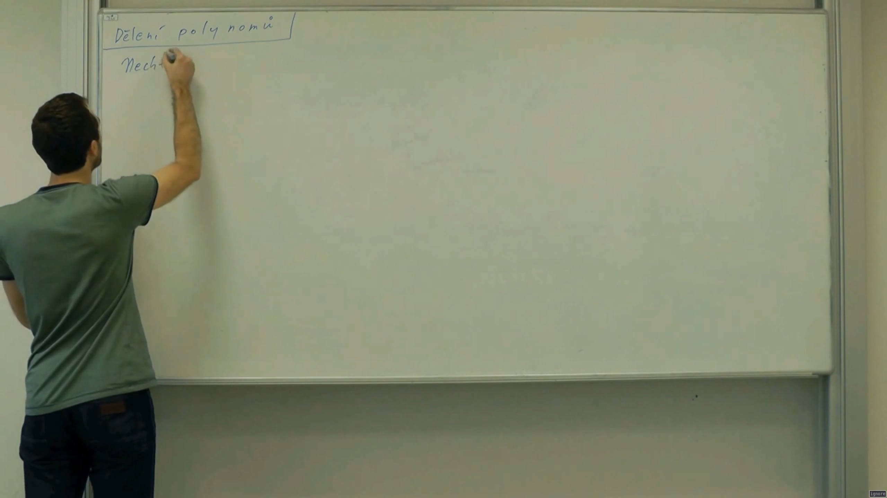

# Video Summarizer 

A tool and browser extensions that determines whether people in a video are currently talking or not and speeds up the video accordingly. Great for skipping time spent writing on a whiteboard in long lecture videos.

(*Click to view video showcase*)

This extension analyses video (typically a Youtube one, but it should work with any HTML video) and, depending on the current loudness of the video, speeds it up at different rates. One can, for example, speed up sections where the teacher is talking to a rate of 1.5x, and sections where the teacher is writing something on the whiteboard to a rate of 4x.

This saves quite a bit of time, especially on long lectures.

[**Get it for Firefox**](https://addons.mozilla.org/en-US/firefox/addon/video-summarizer/) (Important: Videos that are controlled by this extension are stored on my server. Therefore, most videos are not indexed and thus not managed by this extension yet! To index a video, navigate to it and click on the addon icon located next to the URL bar. After a few seconds, the video should be ready to view through the extension.)

Google Chrome and Chromium-based browsers are currently not supported. Mostly because it costs money to purchase a developer account.

## How does it work

There are two parts to this extension: frontend and backend. The backend indexes videos: it downloads them via youtube-dl, extracts sound with ffmpeg and analyses it with shell and awk (yes, the server is written entirely with GNU coreutils). Generally, it seeks parts of videos that are noticeably below or above the average loudness of the video. This way, it can determine which parts of the video are loud and which parts are silent.

When the frontend navigates to a page, it checks for any HTML5 videos. If it finds one, it hashes the current URL (after removing uninteresting query parameters and such) and sends it to the server, which checks whether it has the current video cached. If it does, the frontend will receive a response with information about which parts of video are loud or silent. Otherwise, a button in the extension's pop-up panel (the window that appears when you click the extension button next to the URL bar) that allows the user to submit video to the server for indexing appears. This generally takes about 10 seconds for short videos (under 10 minutes).

## Usage

There are multiple sections in this repository.

- [rust-desktop-cli](rust-desktop-cli) (unmantained obsolete cli. It works, but uses ffmpeg and is a bit slow)
- [extension-backend](extension-backend) (shell & GNU coreutils-powered backend that analyzes the video's sound, caches it, and serves it via HTTP server)
- [extension-firefox](extension-firefox) (Firefox extension that speeds up videos based on backend response) [Get it for Firefox](https://addons.mozilla.org/en-US/firefox/addon/video-summarizer/)

## Results

Everything was tested with ffmpeg 4.2, and Video Summarizer 1.1.1 (the rust cli). Settings: `-l 1.5 -s 100`.

| Name | Duration (s) | Silent time (%) | Saved time (s) |
|---|---|---|---|
|  [DEFCON 17: That Awesome Time I Was Sued For Two Billion Dollars](https://www.youtube.com/watch?v=KSWqx8goqSY) |  1887 | 15.32% | 822 (43.55%) |
|  [1. Introduction and Scope](https://www.youtube.com/watch?v=TjZBTDzGeGg) (MIT AI course) | 2838 |  40.12% | 1706 (60.08%) |
| [Black Mirror: White Christmas ](https://www.imdb.com/title/tt3973198/) | 4326 | 11.93% | 1786 (41.29%) |
| [Puella Magi Madoka Magica Ep 10](https://www.imdb.com/title/tt1773185/) | 1449 | 7.22% | 553 (38.15%) |

## Other projects

- [desed](https://github.com/soptikha2/desed), a TUI debugger for sed written in rust. Supports breakpoints, displays variables and allows one to step both forwards & backwards. Supports live reload while editing the script.
